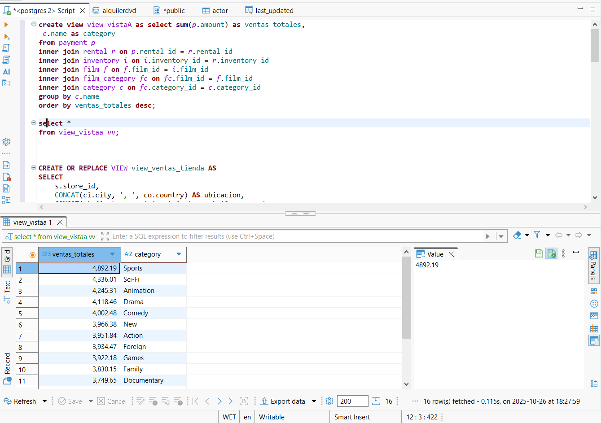
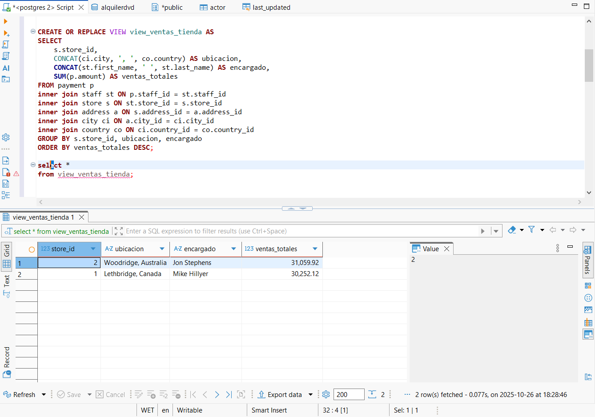
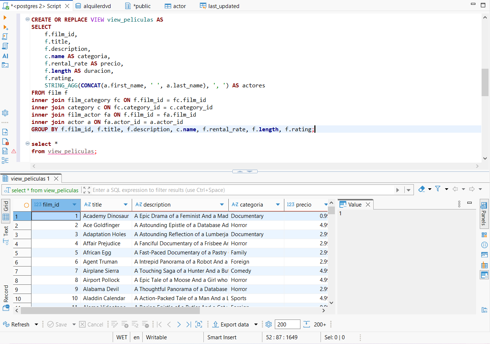
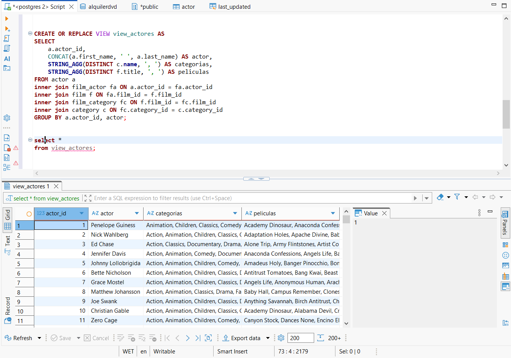
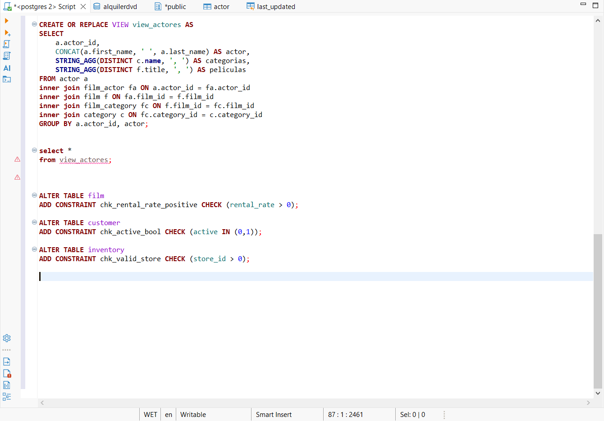
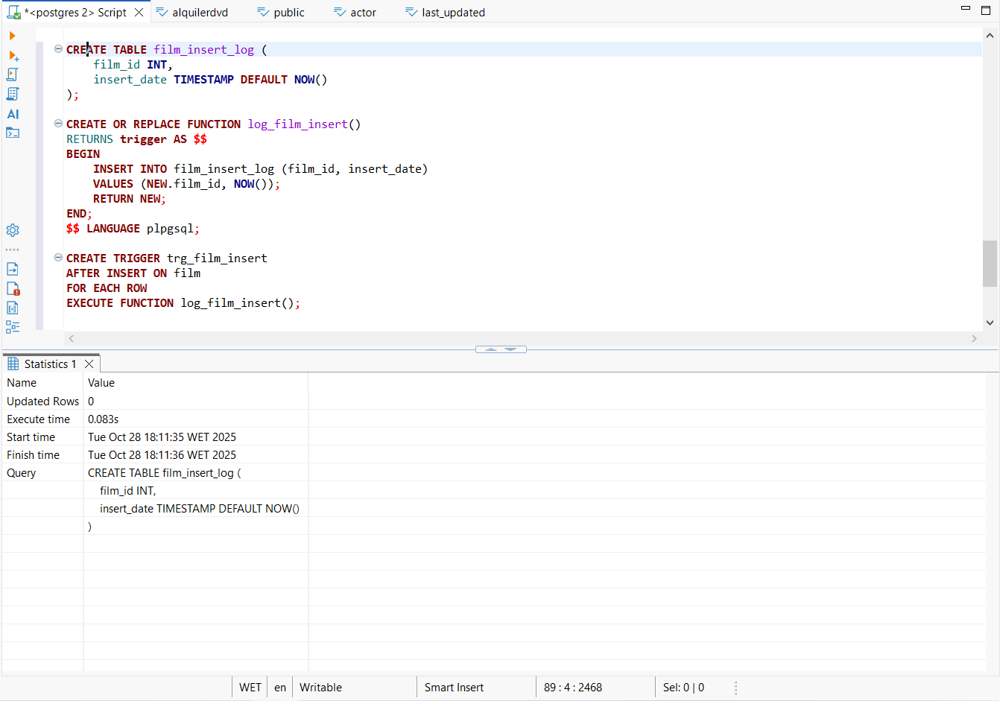
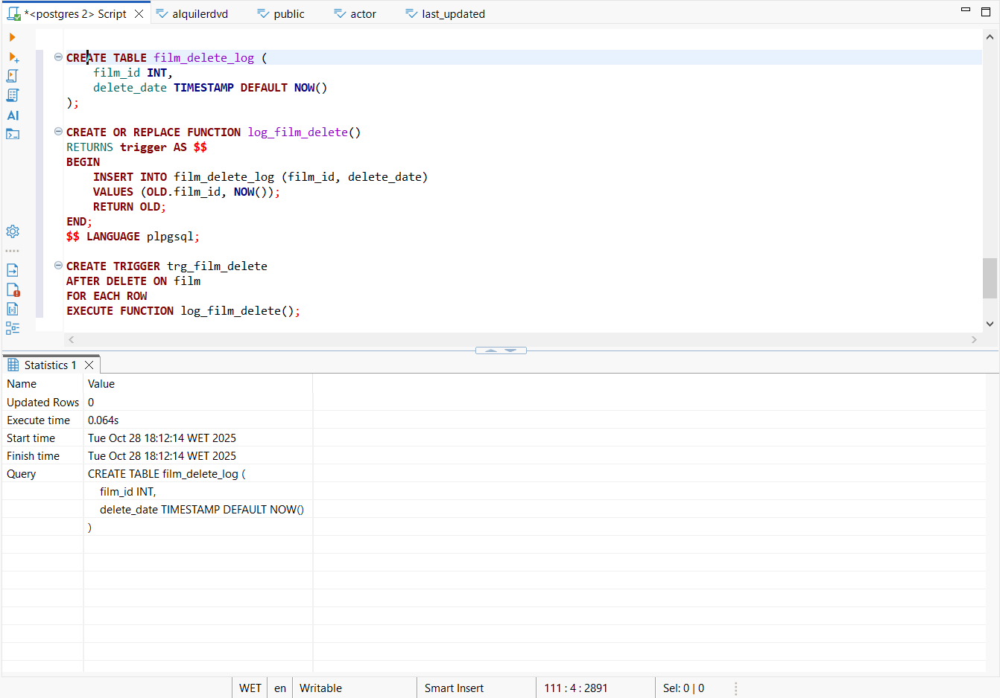

# prct05-AyD-BDD

## Consultas y Vistas

### ventas totales por categoría de películas

---

### ventas totales por tienda,

---

### lista de películas

---

### información de los actores

---

## Restricciones CHECK 

---

## Explique la sentencia que aparece en la tabla customer 

  last_updated BEFORE UPDATE ON customer 
  FOR EACH ROW EXECUTE PROCEDURE last_updated()

Su propósito es actualizar automáticamente el campo last_update con la fecha y hora actuales (NOW()), antes de cada actualización (BEFORE UPDATE)

Se utiliza también en la tabla actor.

## Disparadores

---

